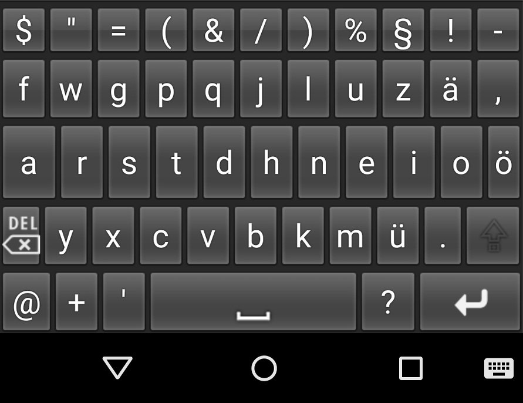

# Android German Colemak Keyboard

An altered (opinionated) take on the english [Colemak](https://colemak.com) keyboard layout for typing in german.

# Features

* typing with two thumbs is super fast and easy in german and english
  * some keys have been swapped due to differences of [digraph frequencies](https://en.m.wikipedia.org/wiki/Digraph_(orthography)) in german to english words
  * umlauts have their own key
  * slightly bigger home row
* doesn't need more modifier keys than shift (although those might be added in future releases
* extra symbols in popup when holding a key

# Screenshots

